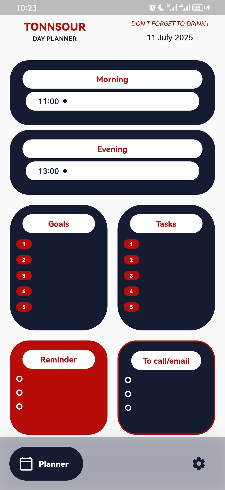

# 📘 Tonnsour — Personal Planner

> *"Be as stingy with your time as you are with your money." — Shaykh Al-'Uthaymin*

**État du projet:** **En production**

Tonnsour est une application mobile qui aide à structurer et planifier ses journées avec intention, clarté et discipline. Inspirée par une méthode de planification papier méticuleuse, elle génère automatiquement des blocs horaires, organise les objectifs et les tâches, et permet de gérer chaque journée — et celle du lendemain — avec un objectif précis.

 <!-- Ajoutez une image ici -->

## Problématique

Je cherchais à remplacer un système de planification papier complexe et statique par une solution numérique dynamique qui préserve la flexibilité et la simplicité d'utilisation du papier, tout en y ajoutant la puissance du digital (historique, génération automatique, rappels).

## Fonctionnalités

- **🕒 Génération automatique de la journée :** Création de blocs horaires personnalisables (matin/soir) basée sur des heures de début et de fin définies par l'utilisateur.
- **📋 Gestion de contenu flexible :**
  - Objectifs et tâches
  - Rappels et notes importantes
- **↔️ Navigation fluide :** Glissement pour naviguer entre aujourd'hui et demain.
- **📊 Historique complet :** Consultation et analyse des jours passés dans une archive (fonctionnalité pas encore accessible)
- **📴 Offline-first :** Conçue pour fonctionner sans connexion internet avec un chargement rapide.
- **🔔 Notifications :** Alertes pour les blocs horaires importants (fonctionnalité pas encore intégrée)

## Stack technique et architecture

- **Framework:** Flutter (Dart)
- **Base de données:** Isar (base NoSQL locale, performante et offline-first)
- **Gestion d'état:** Architecture réactive et logique avec des **Widgets personnalisés** pour une modularité et une propreté du code maximales.
- **Internationalisation:** Prête pour le multi-langue (Français/Anglais).
- **Gestion des notifications:** flutter_local_notifications

## 🧠 Défis techniques

- **Conception d'un algorithme de génération de grille horaire** flexible et personnalisable.
- **Modélisation d'une base de données performante** (Isar) pour une expérience fluide et instantanée.
- **Création d'une interface tactile intuitive** avec une navigation par glissement.
- **Implémentation d'une architecture réactive sur-mesure** sans dépendre à des packages de state management externes, garantissant des performances optimales et un code minimaliste.

## 🔐 Code source

**Ce repository est public à des fins de présentation. Le code source complet est hébergé en privé et disponible pour review sur demande.**

Si la mise en œuvre technique vous intéresse, n'hésitez pas à me contacter via GitHub ou par email pour demander l'accès. Je serais ravi d'échanger sur l'architecture et les choix techniques.

*J'utilise ce projet quotidiennement comme solution principale de planification.*
