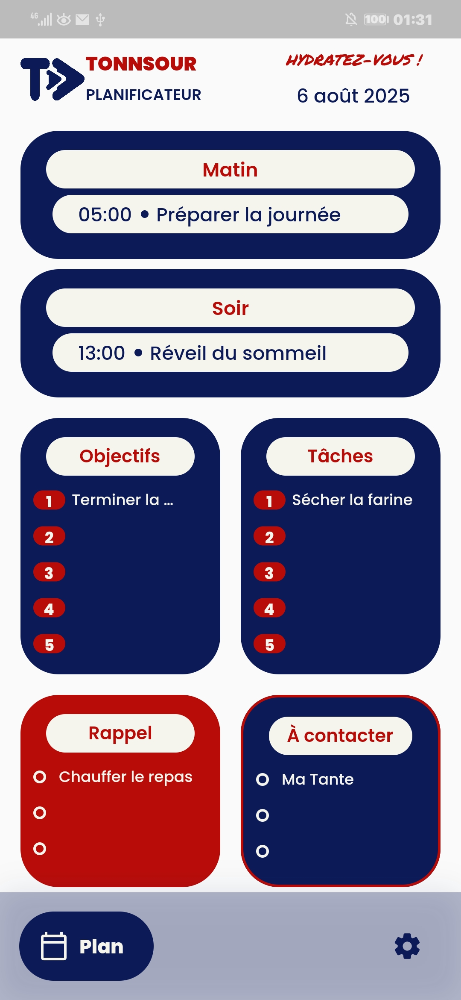

# 📘 Tonnsour — Personal Planner

> Be as stingy with your time as you are with your money.  
> — *Shaykh Al-'Uthaymin*

**Tonnsour** is a mobile application that helps users structure and plan their days with intention, clarity, and discipline. Inspired by a meticulous handwritten method, it automatically generates time blocks, organizes goals and tasks, and empowers users to manage each day — and tomorrow — with purpose.

---

## Project Goals

- Digitize a structured, paper-based planning system
- Automatically generate morning and evening blocks based on custom start/end times
- Enable users to prepare tomorrow from today's page
- Track daily history and view past plans
- Promote time efficiency with a minimal and intuitive user experience

---

## Key Features

- Day generation with morning/evening intervals
- Time-sensitive goals, tasks, and reminders
- Swipe-based day navigation (today ↔ tomorrow)
- Historical archive of previous days
- Offline-first storage and quick loading
- Subtle notifications for important blocks

---

## Technical Stack

- **Flutter** for UI and cross-platform development
- **Isar** for local database and offline storage
- **Custom Widgets** for modular and clean design
- Reactive structures and logic-first architecture

---

## Screenshots

---

## Source Code

This repository is public for presentation only. The full source code is hosted privately and available for review upon request.

If you’re interested in the technical implementation, feel free to contact me via GitHub or email to request access.

---
